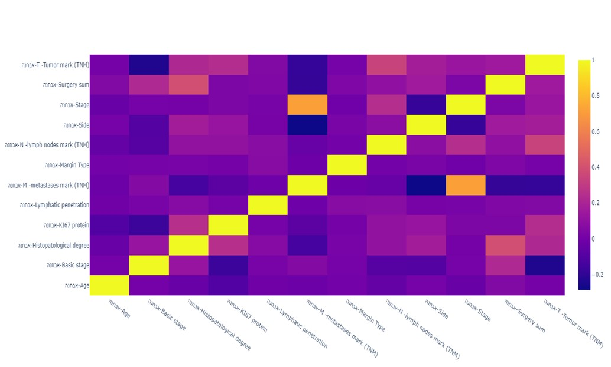
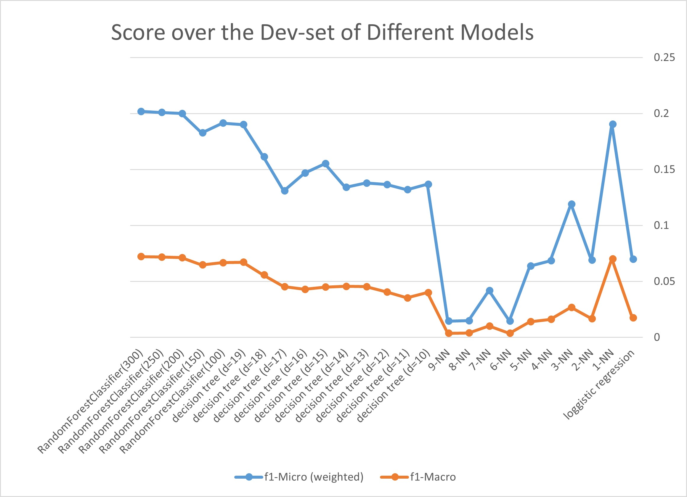
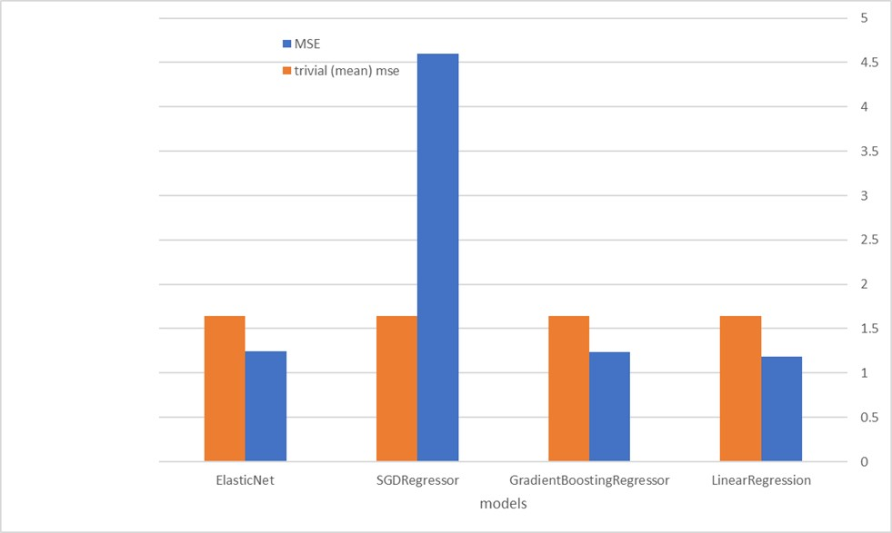

# IML Hackathon
Given real data of breast cancer patients treated in Israel over the last years, we tried predict metastases sites and to estimate the diagnosed tumor size. 
Done as part of IML-Hackathon in course 67577 (IML).

## Team members: Ilana Gelmanm, Lee Oziel, Gal Rubinshtein ,Nava Goetschel

## Motivation
Breast cancer is one of the most pervasive malignant diseases among women in the world and in
Israel in particular. If treated early and appropriately, the chance of remission is high. Our task was to predict certain medical characteristics of the disease for each patient based on their
available data. This can help save doctor’s time, validate and “double-check” their decisions, and
alleviate the cost of expensive tests.

## About the data
The training dataset contains 65,798 entries (across train and test), each with 34 features.
It is supplied in the following files:
* train.feats.csv: 49,351 records in a csv file, where each row contains a single instance (single
patient visit) with 34 features. The first row describes feature names.
* test.feats.csv: 16,447 records in a csv file, each containing a single instance (single patient
visit) with 34 features. The first row describes feature names.
note: The repository does not contain the data, due to the sensitivity of the information.

## Part 1 - Predicting Metastases

### Goal: 
Given each visit characteristics, predict metastases sites (multi-label, multi-class categories).

### Evaluation:
done by using:
1. Micro average F1 score
2. Macro average F1 score
(script evaluate_part_0.py)

### Results:
As we can see, the model that get the minimun score is Random Forest with k=200.

## Part 2 - Predicting Tumor Size

### Goal: 
Given each visit characteristics, predict the diagnosed tumor size (in mm).

### Evaluation:
done by using mean squared error
(script evaluate_part_1.py)

### Results:
As demonstrated, the model that get the minimun MSE is Linear Regression.

